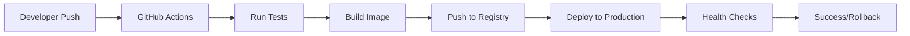

# 🚀 Dell Port Tracer - CI/CD Deployment Guide

## Overview

This guide outlines the modern CI/CD deployment process using GitHub Actions and Docker Registry, addressing the issues encountered during manual deployment.

## 🔧 Setup Instructions

### 1. Repository Secrets Configuration

Add the following secrets to your GitHub repository (`Settings` → `Secrets and variables` → `Actions`):

```bash
# Production Server SSH Access
SSH_PRIVATE_KEY=your_ssh_private_key

# Database Configuration
POSTGRES_PASSWORD=secure_password123
SECRET_KEY=your_secret_key_here

# Switch Credentials
SWITCH_USERNAME=your_switch_username
SWITCH_PASSWORD=your_switch_password

# Optional: Syslog Configuration
SYSLOG_SERVER=10.10.250.18
SYSLOG_PORT=514
```

### 2. GitHub Packages Configuration

Enable GitHub Container Registry for your repository:

1. Go to repository `Settings` → `Pages` → `Packages`
2. Configure package visibility (recommend private for production)
3. The workflow will automatically publish to `ghcr.io/your-username/repo-name/port-tracer`

### 3. Environment Configuration

Create production environment in GitHub:

1. Go to `Settings` → `Environments`
2. Create `production` environment
3. Add environment protection rules (optional):
   - Required reviewers
   - Deployment branches (main only)

## 🏗️ Architecture Benefits

### Problems Solved

| Issue | Manual Process | CI/CD Solution |
|-------|----------------|----------------|
| Git Sync Issues | Manual git pull/reset | Automated from registry |
| Build Context Problems | Manual .dockerignore fixes | Optimized multi-stage build |
| Environment Mismatches | Manual env variable updates | Environment-specific configs |
| Database Issues | Manual export/import | Automated backup and migration |
| SSL/Permission Issues | Manual file handling | Proper file exclusion |
| Version Mismatches | Manual version checking | Automated versioning |

### New Deployment Flow



## 📦 File Structure

```
.github/
└── workflows/
    └── deploy.yml          # Main CI/CD pipeline

docker-compose.registry.yml # Production registry-based compose
Dockerfile.production       # Optimized production Dockerfile
DEPLOYMENT_GUIDE.md         # This guide
```

## 🚀 Deployment Process

### Automatic Deployments

1. **Development**: Push to `develop` branch
   - Runs tests
   - Builds image
   - Deploys to staging (if configured)

2. **Production**: Push to `main` branch
   - Runs all tests
   - Builds and publishes image
   - **Automatically deploys to production**
   - Performs health checks
   - Rolls back on failure

3. **Tagged Releases**: Create git tag `v2.1.6`
   - Creates versioned image
   - Generates release notes
   - Deploys to production

### Manual Deployment

If needed, you can manually deploy:

```bash
# On production server
cd /opt/dell-port-tracer

# Pull latest image
docker pull ghcr.io/your-username/switchportmanager/port-tracer:latest

# Update compose file to use registry image
cp docker-compose.registry.yml docker-compose.yml

# Deploy
docker compose down
docker compose up -d
```

## 🔒 Security Improvements

1. **Multi-stage builds**: Removes development files and secrets
2. **Non-root containers**: Runs as dedicated app user
3. **Minimal attack surface**: Only production dependencies
4. **Automated security scanning**: GitHub Actions security features
5. **Environment separation**: Clear dev/staging/prod boundaries

## 📊 Monitoring and Logs

### Health Checks

- **Application**: `http://server:5000/health`
- **Database**: PostgreSQL health checks
- **Nginx**: HTTP response monitoring

### Logging

- **Application logs**: `/opt/dell-port-tracer/logs/`
- **Nginx logs**: `/opt/dell-port-tracer/logs/nginx/`
- **Deployment logs**: GitHub Actions UI

## 🔄 Rollback Procedures

### Automatic Rollback

The CI/CD pipeline includes automatic rollback:
- Health check failures trigger rollback
- Previous working image is restored
- Services restart with last known good state

### Manual Rollback

```bash
# List available images
docker images ghcr.io/your-username/switchportmanager/port-tracer

# Rollback to specific version
docker compose down
docker pull ghcr.io/your-username/switchportmanager/port-tracer:v2.1.4
# Update docker-compose.yml to use specific tag
docker compose up -d
```

## 🧪 Testing Strategy

### Automated Tests

1. **Unit Tests**: Python pytest suite
2. **Integration Tests**: Database connectivity
3. **Code Quality**: Flake8 linting
4. **Security Scans**: Built into GitHub Actions

### Deployment Validation

1. **Health Checks**: Automated endpoint testing
2. **Database Connectivity**: Connection validation
3. **Service Discovery**: Container networking tests
4. **Performance**: Response time monitoring

## 📈 Benefits Summary

### Reliability
- ✅ Consistent builds across environments
- ✅ Automated rollback on failures
- ✅ Infrastructure as code
- ✅ Reproducible deployments

### Security
- ✅ No SSH keys on production server
- ✅ Minimal container attack surface
- ✅ Automated security updates
- ✅ Secret management through GitHub

### Efficiency
- ✅ Zero-downtime deployments
- ✅ Parallel build/test execution
- ✅ Automated version management
- ✅ Self-documenting pipeline

### Observability
- ✅ Deployment history in GitHub
- ✅ Centralized logging
- ✅ Performance metrics
- ✅ Automated monitoring

## 🔄 Migration Steps

To migrate from manual to CI/CD deployment:

1. **Backup current production**:
   ```bash
   cd /opt/dell-port-tracer
   docker exec postgres pg_dump ... > backup.sql
   ```

2. **Configure GitHub secrets** (as outlined above)

3. **Test the pipeline**:
   - Push to `develop` branch first
   - Verify staging deployment works

4. **Production migration**:
   - Tag current state: `git tag v2.1.5-manual`
   - Push to main branch
   - Monitor deployment logs

5. **Verify deployment**:
   - Check application health
   - Verify data integrity
   - Test all major features

## 🆘 Troubleshooting

### Common Issues

1. **Image pull failures**:
   - Check GitHub token permissions
   - Verify registry access

2. **Health check failures**:
   - Check application logs
   - Verify database connectivity
   - Check environment variables

3. **Database connection issues**:
   - Verify credentials in secrets
   - Check network connectivity
   - Ensure database is healthy

### Support Contacts

- **CI/CD Pipeline**: Check GitHub Actions logs
- **Application Issues**: Review container logs
- **Infrastructure**: Check Docker and system logs

---

This modern CI/CD approach eliminates the manual deployment issues we encountered and provides a robust, secure, and scalable deployment process for the Dell Port Tracer application.
